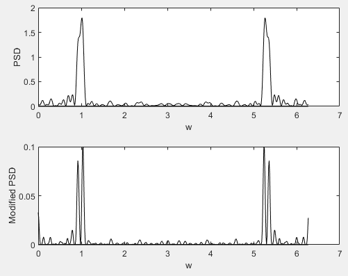

# [Advanced] Better Resolution Using Transformation of the Random Variables

If the sequence is short (N is small), we cannot resolves frequencies being closed together. And, we have at hand only one realization.  
One way to solve it is to create a pseudo-sequence from the data in hand by linear transformation of the RVs. Next, overlapping (by about 25%) these two series, we can process the new series with longer (pseudo) data. This method is based on the linear transformation of RVs.

Ps. The code here is proposed in 8.2 by [1].

1. [Understanding Digital Signal Processing with MATLAB and Solutions](https://www.mathworks.com/academia/books/understanding-digital-signal-processing-with-matlab-and-solutions-poularikas.html)  

Author: Po-Wei Huang  
Date: 2019/05/16  
