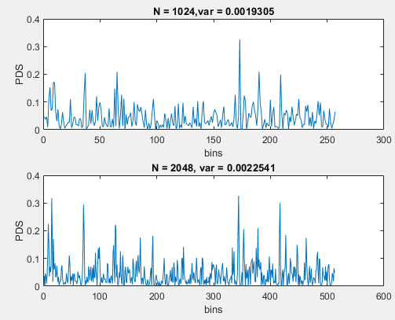

# [Middle] Why is the DFT Square not a good PSD Estimation? Inconsistent Estimation.

When taking the random properties into considerationm, there are two basic requirements, **asymptotically unbiased**, and **consistent**.  
The definition of **asymptotically unbiased** is discussed in [another lab](/Ch10_FourierAnalysisOfSignalsUsingTheDFT/10_5_Periodogram/Basic_AsymptoticallyUnbiased).
The definition of **consistent** is shown as follow. The error between estimated var and real var approches to zero along with the increasing of N.  
```math
\sigma_x^2 = \lim_{L \to \infty }\widehat{\sigma }_x^2=\lim_{L \to \infty }\frac{1}{L}\sum_{n=0}^{L-1}(x[n]-\widehat{m}_x)^2
```  
This experiment shows the two periodograms estimated using **DFT Square**.  
It is apparent that the variances does not decreases along witht the increase of N.  
Consequently, DFT Square is not a good PSD Estimation.



Reference: DSP 10.5
Author: Po-Wei Huang  
Date: 2019/05/16  
