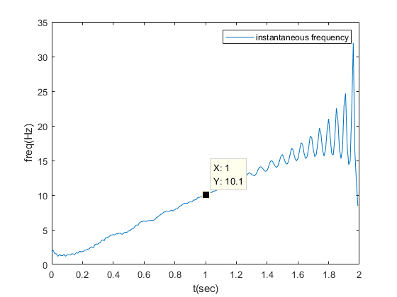

# [Advanced] What's the physical meaning of Hilbert Transform / Hilbert Huang Transform, Analytic signal, and Instantaneous Frequency?
  **Main Scope: Chapter 12 and beyound**  
    
   There are some common-seen signal processing technologies like Hilbert-Huang Transform (HHT), Hilbert-Transform, Analytic Signal, and Instantaneous Frequency. Because there has been a very good article which explains all the terms with elegant and simple samples, I just provide a simple instantaneous frequency estimation example of Hilbert Transform. The detail examples please reference to [this article](https://www.cnblogs.com/xingshansi/p/6498913.html). Then the relationships of the terminology are briefly listed as follow. 

 - Hilbert Transform: 
	 - Just a kind of filter/ Transform
	 - Analytic Signal of x = x + Hilbert Transform[x] = Mag(t) * exp(Phase(t) * t)
	 - Advantages:
		 - Envelop Detection = Mag(t)
		 - Instantaneous Frequency /Phase Estimation (comes from Phase(t))
	 - Limitation:
		 - Vary vulnerable to noise -> Leading to Hilbert Huang Transform (HHT) with the aid of EMD.
 -  HHT
	 - HHT = EMD+Hilbert Transform.
	 - Using **Empirical Mode Decomposition (EMD)**  to generate several cleaner signals, (a.k.a **Intrinsic Mode Functions (IMF)** ).
	 - Limitation:
		 - Representation issue: Usually, you cannot explain the physical meaning of the generated IMF signal.
		 - Gibbs phenomenon.
		
      
.    
.  

Author: Po-Wei Huang  
Date: 2019/11/24  