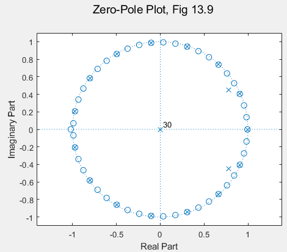
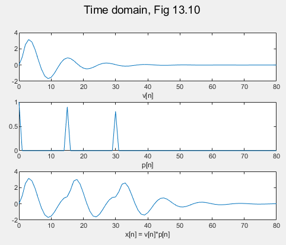
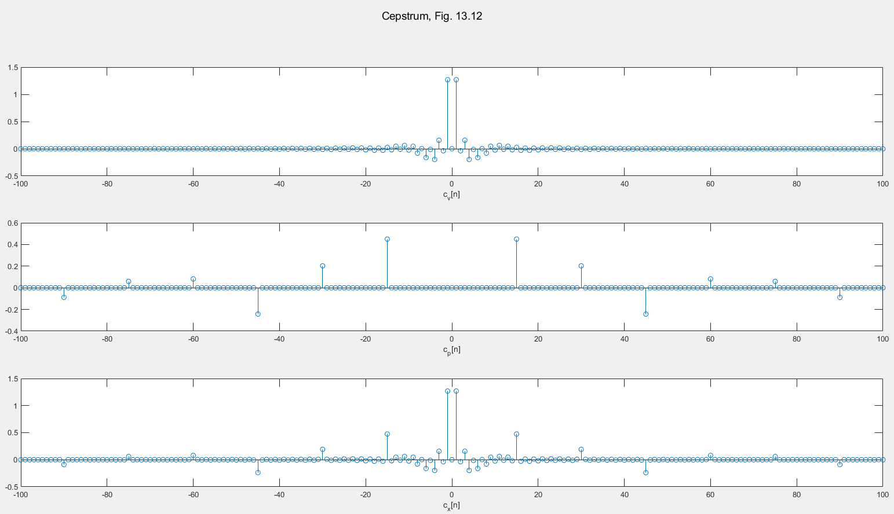
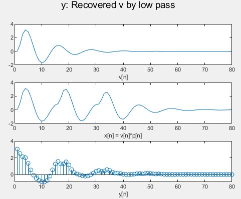
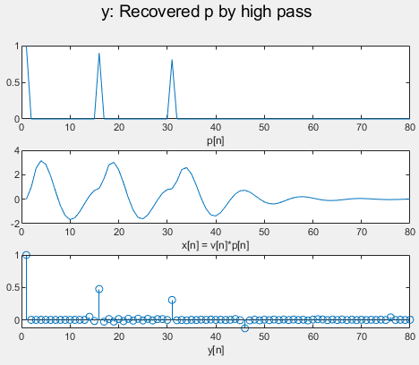

# [Advanced] How to De-convolution? Cepstrum Using DFT For Multipath Model

**Main Scope: Chapter 13.1-3,8-9**

For the received signal polluted by additive noise, there have been many methods to deal with such as Wiener filter. Then, how do we cope with **convolutional** noise with specific pattern?  
  
One of the most basic and famous method is **Homomorphic Deconvolution**  based on **Cepstrum**.  This method works well on the signal model consisting of the convolution of two components. One component's spectrum is slowly varying in frequency and the other's is rapidly varying quasi-periodically in frequency (i.e. echo pattern of impulse train in time domain).  
  
This method is simple, easy to learn and has been applied on so many fields. (The function of cepstrum estimation is only 4 line in matlab.) Please refer to Chapter 13 in the bible for formal derivation. This lab is just the implementation of 13.9. 
The question is started with a simple multi-path (reverberation) model.

````math
x[n]=v[n]*p[n]
```` 
where x[n] is received signal, v[n] is original signal and p[n] is the channel model (i.e. echo pattern).  Without loss of generality, we assume that V[z] and P[z] is known.  

````math
P(z)= \frac{1-\beta^3z^{-3N_0}}{1-\beta z^{-N_0}}  
```` 
````math
V(z)=\frac{b_0+b_1 z^{-1}}{(1-r e^{j\theta} z^{-1})(1-r e^{-j\theta} z^{-1})))}  
```` 
````math
X(z)=P(z)\times V(z)  
```` 
  
The Zero-Pole Plot of X[z] shown as follows.  
  
  
  
The time domain of each signal is depicted as follow.  
  
  
  
 Moreover, the cepstrum is illustrated in Fig.3.  
   
     
  
  Finally, with **frequency** invariant filtering, convolution in frequency domain and multiplication time domain, we can estimate the v[n] and p[n] from polluted received signal x[n].  The extracted v[n] is shown as follow.  
  
      
       
   The estimated p[n] is shown as follow.  
   
      
     
  
  
Author: Po-Wei Huang  
Date: 2019/05/18  
