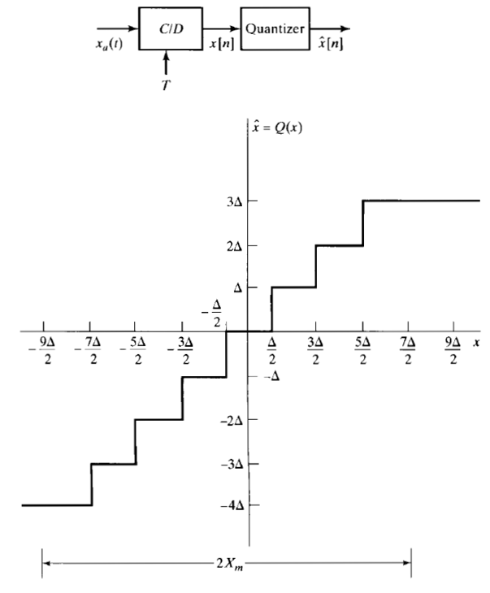
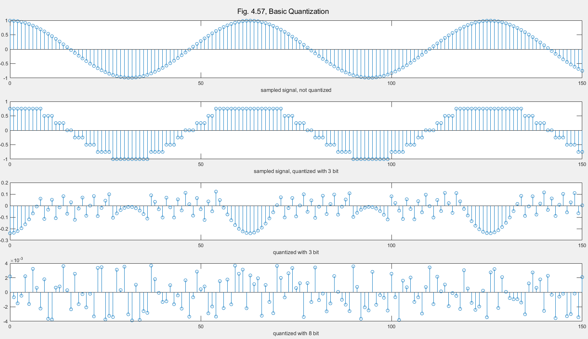
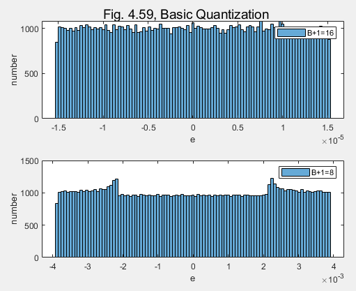
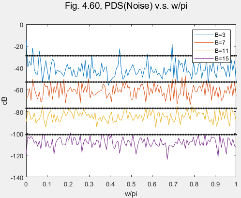

# [Basic] Basic ADC: Visualize Quantization Noise  
  **Main Scope: Chapter 4.8.2-4.8.3**  
     
   There are tow important part for an ideal and basic ADC. As depicted in Fig 1, ADC consists of a Sampler and a Quantizer. The effect of sampling has been well discussed in previous section (4.1-1.3). Here we focus on the effect of quantization. This article is just the implementation of Sample 4.11 & Sample 4.12 of the bible.
    

**Please Note**: *discrete-time signal is* **not** *digital signal*.
  
  
Symbol        | Sampling  | Quantization |       Formal Name | 
--------------|:---------:|-------------:| -----------------:|
x_a(t)        | No        |  No          | Continuous Signal |  
x[n]          | Yes       |  No          | Diecrete Time Signal |  
\hat x[n]     | Yes       |  Yes         | Digital Signal |  
  
  
###  Sample 4.10: Visualize Quantization Noise, Fig. 4.57
*Watch out:* ADC with small Bits leads to severe non linear and not fairly distortion, especially in peaks and troughs.  
  
   

###  Sample 4.11: Measure Quantization Noise's distribution and spectrum, Fig. 4.57
This sample shows that Quantization noise can be modeled as a uniformly distributed white noise with enough Bits.
  
*Uniformly distribution*
   

*White Noise (Flat spectrum)*

Author: Po-Wei Huang  
Date: 2019/07/05  