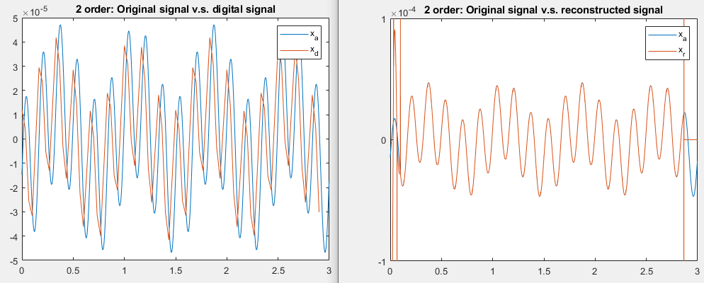

# [Middle] What is the really meaning of Interpolation? ADC/DAC
  **Main Scope: Chapter 4.8-4.9**  
    
   We all know that interpolation doesn't add any new information at all. So, should we always don't use interpolation? When do we really need the Interpolation? How to choice the method? What's the physical meaning?  
   
   In some cases, we want to obtain the signals of high differential orders. Intuitively, we just take difference sequence as features. The result is highly distorted. In fact, interpolation do help very much in this scenarios.
   
   To lessen the distorted noise, simulated DAC is a very good choice of Interpolation rather than conventionally spline, linear. Because this method has its very useful physical meaning and follow the rules of Nyquist Theorem (Important). Detail introduction and explanation is reported in HigherOrdreDifference_ADC_DAC.pdf. Please take a look at it.  
     
   This article illustrate that we can obtain band limited features  in 30 fps almost the same as 1500 fps, as long as the proper design of interpolation. The result obtain before and after is shown on the Fig below (left and right). 
   
   
    
Author: Po-Wei Huang  
Date: 2019/07/05  