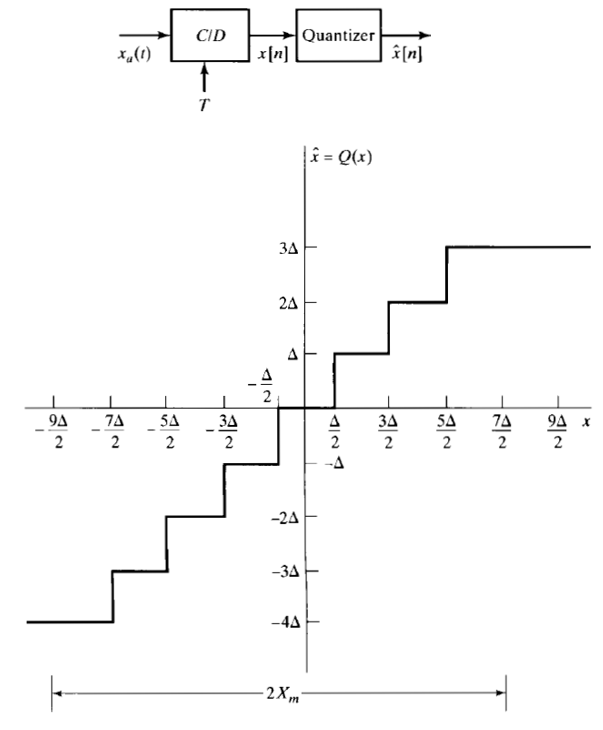
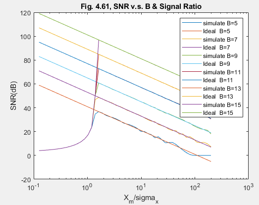

# [Middle] A little more about Quantization Noise (1)
  **Main Scope: Chapter 4.8.3**  
    
   One of the most well known and useful formula is shown below
   ``` math 
   SNR = 6.02B (dB).
   ```
   That is to say, we will gain 6dB SNR after add one more bit in ADC. However, there are several factors which influence SNR very much, including X_m, power of signal, sampling rate. In this article we focus on the X_m and power of signal. The definition of X_m is defined in the figure shown below. This article is the implementation of Sample 4.11 in Chapter 4.3.8.
 
  
    

A little more proper (but not perfect) SNR formula is shown as below  
  ```math
    SNR = 6.02B+10.8 - 20 log_{10}(\frac{X_{m}}{\sigma_{x}})(dB).
   ```

**Please Note**: It is very **worthy** to  **implement a quantizer** by your own. It would be fun and there is a little know-how inside it.   Once you implement a wrong quantizer, you will never get the correct simulation graph as shown below.   
In my simulation (../lib/Quantizing.m), the curves are very close to theoretical curves in the linear region.   
The difference between theoretical curves and simulation curves under 1 X_m/std(x) ratio is due to saturation. 
   
    
    

Author: Po-Wei Huang  
Date: 2019/07/05  