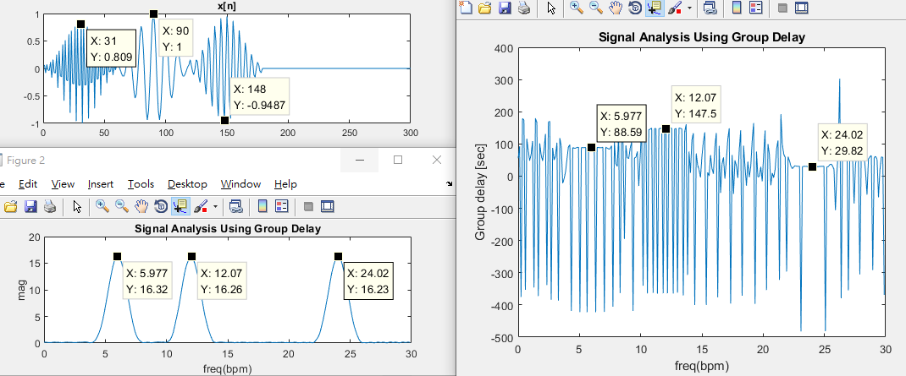

# [Advanced] What's the meaning for group delay of a signal? Insight to group delay.
  **Main Scope: Chapter 5.1 and think more**  
  According to the definition of group delay and examples of  [previous article](/Ch5_TransformAnalysisOfLTISystem/Middle_EffectOfGroupDelayAndAttenuation)  , we all know that the group delay is an important property of filters. The estimation of group delay comes from phase response of a system.   
  Then, what if we apply the same operation on a signal? What's the meaning for group delay of a signal?  Here I extend the example from Chapter 5.1.2. Estimating the group delay of a signals consisting of three sub-signals with different frequencies, we can observe that the **group delay of a signal just indicates the time shift of each sub-signal**.   
**Advanced**: Uncomment the 'unwarp' in filter_analysis_imp.m and observe what will happen. 
  
  
  
Author: Po-Wei Huang  
Date: 2019/06/16  