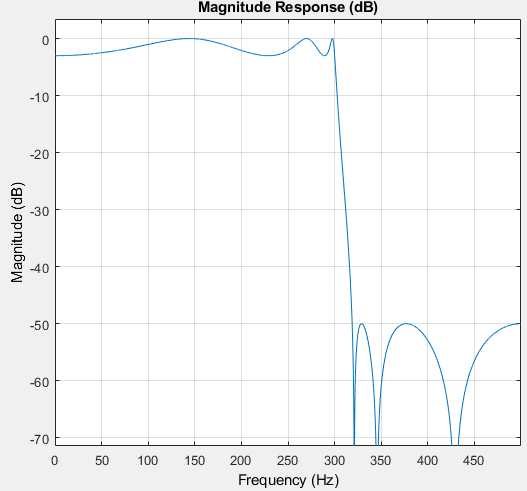

# Filter Visualization

Matlab provides a very simple and accurate filter visualization tool, fvtool, including both magnitude and phase. 

Basic usage of this tool is provided here. 
For more information, please refer to [official doc](https://www.mathworks.com/help/signal/ref/fvtool.html).
  
  
  
  
Date: 2019/05/10
