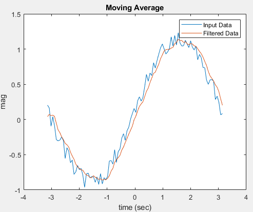

# [Basic] Filter a signal with IIR filter in matlab.

This experiment provide an example of filtering a signal for any LTI Filters (including both **IIR** & FIR). Please run all the .m files here.  

When using command **conv**, we have to provide impulse response of a system. Due to limit of length in practice, it is impossible to **conv** a **IIR** system in matlab. So, another command, **filter**, is provided. With the usage of rational function and initial state (**zi**), we can filter a signal using any type of LTI filter and recursively.  
In the future, we will show how to analyize a filter in frequency domain and convert it into difference equation (time domain).

```math
H(z)=\frac{\sum_{i=0}^Z b_i z^{-i}}{1+\sum_{j=1}^P a_j z^{-j}}
```
where P is the number of poles and Z is the number of zeros. If the P is zero, then the system is so called FIR system; otherwise, it is IIR Filter.

**Major Function: filter.**
**Please note usage of initial condition (zi)**  
~~~~
filter(b,a,x,zi)
~~~~





Author: Po-Wei Huang  
Date: 2019/05/05