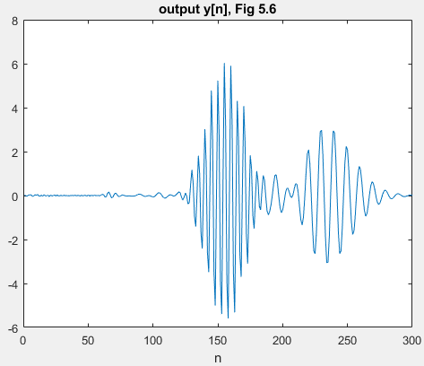
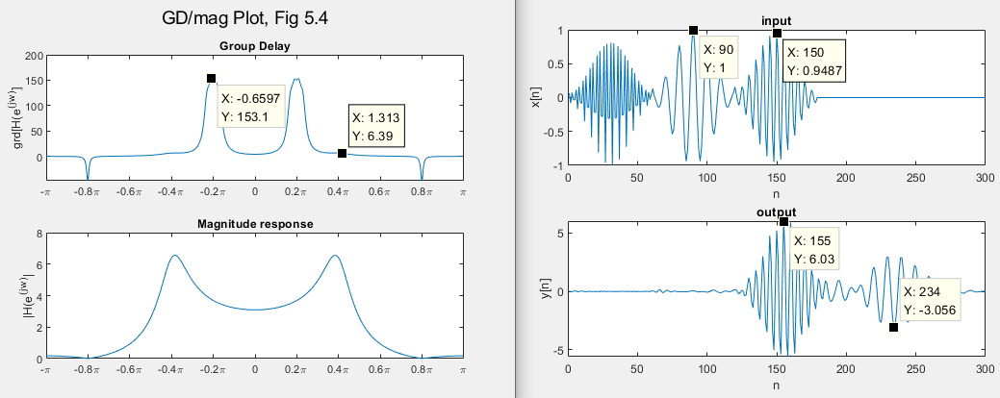

# [Middle] What's the unit of Group Delay? Effect of Group Delay and Attenuation
  **Main Scope: Chapter 5.1**  
  According to the definition of group delay, we all know that the group delay is the -1 times derivative of phase w.r.t angular freq. However, should the delayed sampled point happened to be the value of group delay? Let's give it a try.  
    
  The example and introduction in Chapter 5.1.2 is a well-designed and straight forward. Please refer that section and the code in this lab simultaneously. This experiment provides the implementation of Chapter 5.1.2. Please note that the value of the group delay roughly equals to the delayed sample points.  
  
  
  
  
  
  
  
  
Author: Po-Wei Huang  
Date: 2019/05/31  