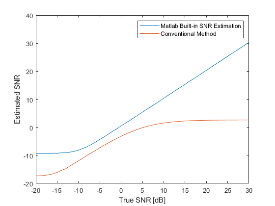

# [Middle] Ch10: Do you realy understand the SNR?
**Main Scope:Chapter 10**   
     
   Signal to Noise ratio (SNR) might be the most simple and most common signal quality index (SQI). Then, do we estimate the SNR correctly?
A basic test is given a received signal x[n] as below,
   
```math
x(n) = A cos(2 \pi f_{0} n) + w(n), w \sim N(0,\sigma).
```  

Then, the estimated SNR should be  

```math
SNR = \frac{A^2}{2 \sigma^2}.
```    

Try the SNR estimator shown below. Although the estimator seems to be reasonable, you will get surprising result.  
**The SNR estimater always underestimate the true SNR.** Please think about the reason before see the answer?  

     %% PNR Estimation Basic Version.
	function pnr = estimatePNR(PowerSpectrumDensity)
		[mag,index]=max(PowerSpectrumDensity);
		
		peak_power = PowerSpectrumDensity(index);
		if index>=2 % add the bin before the max.
			peak_power = peak_power+PowerSpectrumDensity(index-1);
		end
		if index<length(PowerSpectrumDensity) % add the bin after the max.
			peak_power = peak_power+PowerSpectrumDensity(index+1);
		end
		noise_power = sum(PowerSpectrumDensity)-peak_power;
		pnr = 10*log10(peak_power/noise_power);
	end  
   
**Result:**

.

Author: Po-Wei Huang  
Date: 2019/10/31  