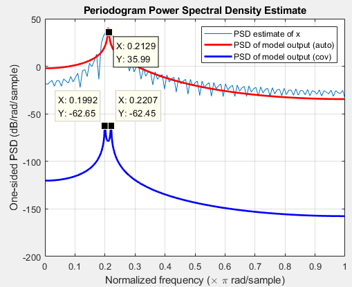

# [Ch11. Parametric Signal Model  (a.k.a. AR Model)] Better Frequency Resolution with smaller points, Estimating Frequency of Sinusoidal

When it comes to estimating the main frequency of sinusoidal like signals with **finite length**, the most intuitive method might be observing the largest component in the DFT/DTFT. Nonetheless, the resolution of DFT is limited by windowing effect. If a known structure of the signals is given, these method are not the best way to estimate the frequency.

   With the known structure of the signals, Professor Oppenheim introduced an alternative way to estimate frequency,**ParametricSignal Modeling (a.k.a. Autoregressive model, AR Model)**[1]. To apply this method, a structure of all-pole linear system, H(z), should be predefined. This all-pole system tries to represent the signal with relative small set of parameters (or coefficients). Then, we estimate the coefficients of the system with observed signals. Last, the DTFT of the system can be regarded as the power spectrum density (PSD) of the observed signals.

   There are two basic methods to estimate coefficients from a observed signal s[n] with  finite length (11.3). One is **autocorrelation method** and the other is **covariance method**. The main difference between these two method is the definition of prediction error. The length of s[n] is M+ 1 and the order of H(z) is p.

- **Autocorrelation Method** considers all M+p length of error (i.e. n ranges from zero to M+p).
  - Prediction error of the first p and the last p samples can be large due to zero samples.
  - Hamming window is applied to reduced the influence, but the prediction error cannot be eliminated to zero.
  - The system is stable (see problem 11.10[1]).
- **Covariance Method** only considers n in smaller interval (p to M).
  - There is no end effects like autocorrelation method and thus no need for Hamming window.
  - The prediction error can be zero for deterministic signal. 
  - Stability is not guaranteed.

Professor Oppenheim provided an example in 11.5.3. He tried to estimate the frequency of the sum of two sinusoids in only 101 samples. 

     s[n] = 20cos(0.2*pi*n - 0.1*pi) + 22cos(0.22*pi*n+0.9*pi).

Here I tried to provide a potential matlab code to generate Fig. 11.16 in the DSP Fig.1. Please note that conventional methods like DFT or PSD cannot distinguish the two components. Neither does the Autocorrelation Method due to the windowing effect. (The main lobe of window is 0.04pi(rad/s) but the frequency difference of the two sinusoids is 0.02pi (rad/s).) **Only Covariance Method can separate the two components in this example.**

.