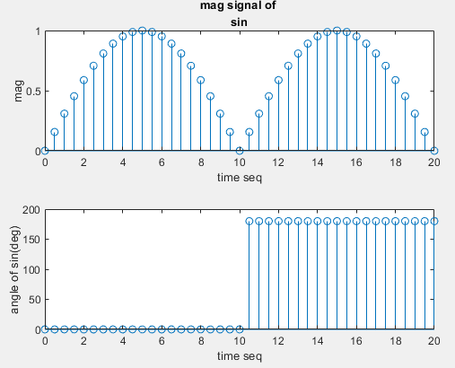
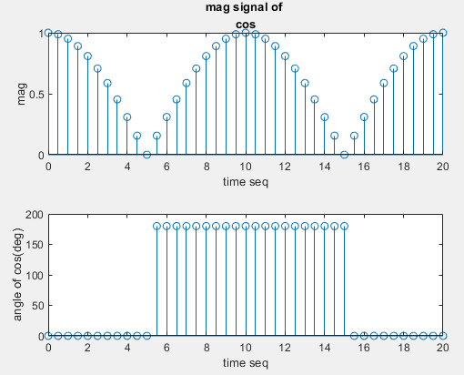
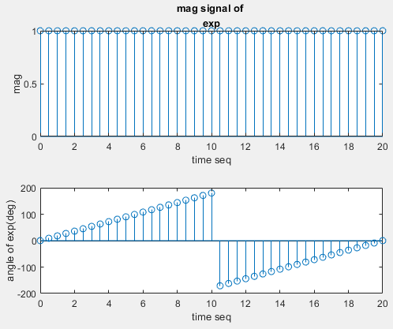

# [Basic] Observe Phase and Mag of a signal.

Example of phase observation of common signals.

**Please Note the unit conversion and usage of angle.**  
**Please Understand the shape of the phase.**
~~~~
 angle(x_sin)/pi*180 % note the conversion, from rad to deg.
~~~~

Date: 2019/05/05