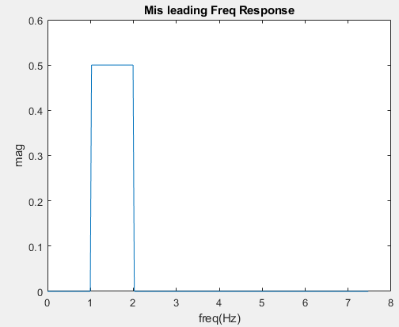
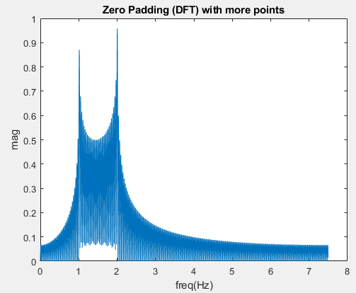

# [Middle] Why is it a bad idea to filter by zeroing out FFT bins?

The complexity of DFT/IDFT using FFT/IFFT is only n*log2n whereas the complexity of convolution is n square. Then, why do we need to learn so many methods to design a filter? Why is it a bad idea to filter by zeroing out FFT bins? This question might be the most confusing one when learning DSP.

To verify this fact is simple, we just need to **cautiously**  observe the spectrum of impulse response of an ideal(?) band pass filter which just zeros out FFT bins. Why do I need to add the adverb **"cautiously"**?  If we just use the same size of the FFT to observe the response of the impulse, we will be deceived as shown in Fig 1.

. 

Nonetheless, if we add the order of DFT when observing the output of the filter, that is, zero padding the impulse response, we can find the so called Gibbs phenomenon, ripples in frequency domain, as depicted in Fig.2. 

.

The results in fact comes from the windowing effect. If you want to entirely understand the problem, please refer to chapter 7.6 and chapter 10.1-10.2 of the bible of DSP [1]. To sum up, three key points are noted here.

1. Size of window and order of DFT(FFT) are totally independent. Don't mix them together.
2. Properties of window (type/size) dominate the shape of DTFT. (ex. wider main lobe lead to wider transient band in frequency response.)
3. DFT is just the sampling of DTFT in frequency domain. Moreover, the higher the order of DFT, the denser the spectrum of DFT is.

So, with the help of denser spectrum in Fig.2, we can see through the mask of ideal(fake) Band pass filter.

[1] Alan V. Oppenheim and Ronald W. Schafer. 2009. Discrete-Time Signal Processing (3rd ed.). Prentice Hall Press, Upper Saddle River, NJ, USA.